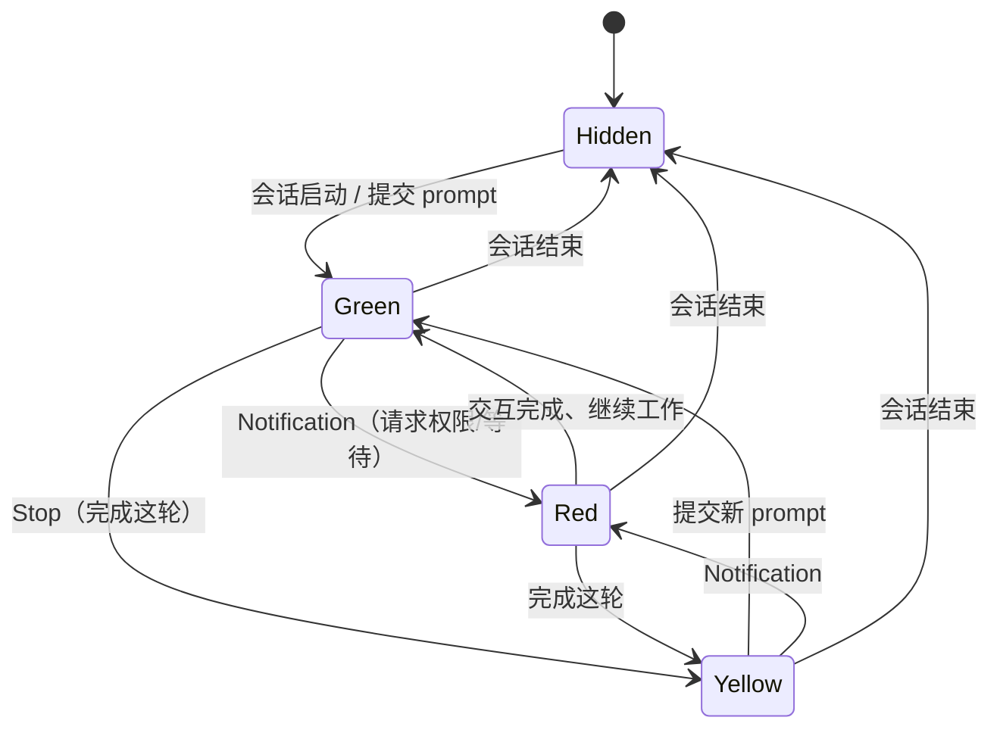

# AI Work Traffic Light — 需求文档

## Summary

一个 Windows 桌面小应用，用红绿灯实时反映 Claude Code 的状态：🟢 在干活、🟡 干完这轮该你了、🔴 中途卡住在等你。灯是常驻置顶的悬浮小窗，停在任务栏左下角（天气组件旁边）；没有会话在跑时隐藏，红灯时额外弹系统通知 + 可选提示音。状态通过 Claude Code 官方 hooks 读取，多会话时显示最紧急的那个并标出是哪个会话。

---

## Problem Frame

用户用 Claude Code 处理任务时，经常切到别的窗口去做别的事。Claude 在任务中途请求权限或确认（比如要不要执行某条命令）时，会停下来等待——但用户没盯着那个窗口，**根本不知道它在等自己**。结果是任务卡在那儿空等，时间白白浪费；等用户想起来切回去，可能已经过了很久。

痛点最尖锐的地方正是 Claude Code：它在执行命令、改文件等操作前频繁请求授权，这种"安静地等你点确认"的时刻最容易被错过。

---

## Key Decisions

- v1 只做 Claude Code（终端 + VSCode 扩展），Windows 优先。Claude Code 有官方 hooks，检测可靠，且权限确认痛点最集中在这里。桌面聊天 App 无 hooks，跨平台支持都先放后面。
- 状态检测走 Claude Code hooks：`UserPromptSubmit`→绿、`Stop`→黄、`Notification`→红。hooks 装在全局配置里，以 fire-and-forget 的方式把信号推给本地监听进程。这是一条**不依赖任何屏幕抓取 / OCR** 的官方机制。
- 状态模型按紧急程度分级：红 = 任务中途被卡住（紧急，立刻回来），黄 = 完成这轮该你了（不紧急），绿 = 工作中。区分"卡住"和"完成"，让用户知道要不要马上回去。
- 用悬浮窗、不用真正的任务栏图标。Windows 11 弃用并逐步移除了 deskband(任务栏工具栏) API，常驻置顶的悬浮窗是落到任务栏左侧的唯一可行办法（TrafficMonitor、BatteryBar 同款思路）。
- 红灯配主动提醒。全屏应用会盖住任务栏，光靠被动的灯会错过最关键的一刻，所以红灯额外弹系统通知 + 可选提示音；黄灯只被动显示。
- 多会话取最紧急 + 标出是哪个。单灯显示 红 > 黄 > 绿；红灯时用项目文件夹名告诉用户是哪个会话需要自己。

上图是单个会话的状态机；多会话时，悬浮灯显示所有会话里最紧急的状态（红 > 黄 > 绿），所有会话都结束后隐藏。

---

## Actors

- A1. 用户 — 运行 Claude Code 的开发者，需要在 Claude 等待时被及时叫回。
- A2. Claude Code 会话 — 终端或 VSCode 扩展里的一个运行实例，触发 hook 事件；可能同时有多个。
- A3. 红绿灯 App — 本次要做的 Windows 应用：托管悬浮灯、监听 hook 信号、聚合多会话状态、发提醒。

---

## Requirements

**状态检测（基于 hooks）**

- R1. App 依据 Claude Code 官方 hook 事件判定每个会话的状态。
- R2. 事件到状态的映射：提交 prompt / 开始工作 → 绿；完成这轮 → 黄；请求权限 / 等待用户 → 红。
- R3. hooks 安装在用户/全局级别，覆盖所有项目和会话，无需逐仓库配置。
- R4. App 自动写入/合并 hook 配置到全局 Claude Code 设置（`~/.claude/settings.json`），用户无需手动编辑 JSON。

**指示器与状态**

- R5. 用单个常驻置顶的悬浮小窗显示当前灯，定位在 Windows 任务栏左下角、天气组件附近。
- R6. 没有任何 Claude Code 会话在运行时，指示器完全隐藏。
- R7. 灯在 Claude 工作时显示绿，完成这轮（该用户、不紧急）时显示黄，中途卡住等待用户（紧急）时显示红。

**提醒**

- R8. 切换到红灯时，App 弹出 Windows 系统通知（含会话标识）并播放可选提示音，使用户在全屏应用遮住任务栏时也能察觉。黄灯不触发主动提醒。

**多会话聚合**

- R9. 多个会话同时运行时，灯显示所有会话中最紧急的状态（红 > 黄 > 绿）。
- R10. 处于红灯时，通知与指示器用会话的项目文件夹名标明是哪个会话需要关注。
- R11. 某会话结束时，从聚合中移除其状态并重算；没有会话剩余则隐藏。

**交互**

- R12. 点击指示器可聚焦/前置需要关注的那个会话的 VSCode 窗口。（需求已记录，实现放到后续阶段，v1 不做。）

---

## Key Flows

- F1. Claude 开始工作 → 绿灯
  - **Trigger:** 用户在某会话提交 prompt（`UserPromptSubmit`）
  - **Actors:** A2 → A3
  - **Steps:** 会话触发 hook → App 标记该会话为"工作中" → 重算聚合 → 无更紧急状态时显示绿
  - **Outcome:** 灯为绿（若另有会话更紧急则保持红/黄）
  - **Covers:** R1, R2, R7, R9

- F2. Claude 请求确认/权限 → 红灯 + 通知
  - **Trigger:** 会话触发 `Notification`（请求权限或等待输入）
  - **Actors:** A2 → A3 → A1
  - **Steps:** hook 触发 → App 标记该会话为"卡住" → 聚合变红 → 弹系统通知（含项目名）+ 可选提示音
  - **Outcome:** 灯红，用户收到通知，知道是哪个会话在等自己
  - **Covers:** R7, R8, R9, R10

- F3. Claude 干完这轮 → 黄灯
  - **Trigger:** 会话触发 `Stop`
  - **Actors:** A2 → A3
  - **Steps:** hook 触发 → 标记"完成这轮" → 聚合（红优先）→ 显示黄
  - **Outcome:** 灯黄，被动提示该用户了，不弹通知
  - **Covers:** R7, R9

- F4. 会话结束 → 重算/隐藏
  - **Trigger:** 会话结束（`SessionEnd`）或进程消失
  - **Actors:** A2 → A3
  - **Steps:** App 移除该会话状态 → 重算聚合 → 仍有会话则显示其最紧急状态，无会话则隐藏
  - **Outcome:** 灯反映剩余会话；无会话时隐藏
  - **Covers:** R6, R11

- F5. 点灯跳转到对应窗口（后续阶段）
  - **Trigger:** 用户点击指示器
  - **Actors:** A1 → A3
  - **Steps:** App 找到最紧急会话 → 聚焦/前置其 VSCode 窗口
  - **Outcome:** 直接切到需要用户的那个窗口
  - **Covers:** R12（实现延后）

---

## Acceptance Examples

- AE1. 任务中途请求权限 → 红 + 通知
  - **Given:** 一个会话正在工作（绿）
  - **When:** Claude 请求运行某命令的权限（触发 `Notification`）
  - **Then:** 灯变红；弹出系统通知，标明是哪个项目；可选提示音响起
  - **Covers:** R7, R8, R10

- AE2. 没有会话 → 隐藏
  - **Given:** 当前没有任何 Claude Code 会话
  - **Then:** 悬浮灯完全不显示
  - **Covers:** R6

- AE3. 双会话、其一变红
  - **Given:** 会话 A（绿，正在工作）与会话 B（黄，已完成）
  - **When:** 会话 A 触发 `Notification`
  - **Then:** 灯显示红（最紧急）；通知/指示标明是会话 A 的项目名
  - **Covers:** R9, R10

- AE4. 红灯会话被全屏应用遮挡
  - **Given:** 用户在全屏应用中，任务栏被遮住
  - **When:** 某会话变红
  - **Then:** 系统通知 + 可选提示音仍然触发，用户得以察觉
  - **Covers:** R8

- AE5. 完成这轮后又给新指令
  - **Given:** 会话为黄（完成这轮）
  - **When:** 用户提交新 prompt
  - **Then:** 灯转绿
  - **Covers:** R7

---

## Success Criteria

- 用户不再错过 Claude Code 的权限/确认提示：红灯出现后几秒内能察觉，即使人在全屏应用里。
- 安装即用：一步完成 hooks 配置，全程不需要手动编辑任何 JSON。
- 不打扰：Claude 正常工作时灯安静待在角落，无会话时彻底隐藏，不抢占注意力。
- 多会话下，用户能立刻看出是哪个项目/窗口在等自己。

---

## Scope Boundaries

**先放后面（以后会做）**

- macOS、Linux 支持（v1 仅 Windows）。
- R12 点灯跳转 VSCode 窗口的实现（需求已记录，v1 不实现）。
- 黄灯的主动提醒（v1 黄灯仅被动显示）。

**不属于本产品定位**

- Claude 桌面聊天 App 的状态检测——它没有 hooks，且确认痛点不在那里。
- 会话仪表盘 / 历史记录 / 用量统计 / 会话管理——本产品是个氛围状态灯，不是 Claude 会话管理器。
- 用 ExplorerPatcher 等工具恢复经典任务栏/deskband 的方案——脆弱、与 Windows 持续对抗。

---

## Dependencies / Assumptions

- **关键假设（需优先验证）：** Claude Code 的 `Notification` hook 会在"请求权限 / 等待用户输入"时可靠触发，且在 VSCode 扩展与终端中行为一致。整个产品的成立与否取决于这一点。
- hook 输入 JSON 含会话标识（`session_id`）与工作目录（`cwd`，用于推导项目名）——确切字段名待规划时核实。
- 用户运行 Windows 11（悬浮窗定位策略针对 Win11 任务栏）。
- 全局 `~/.claude/settings.json` 可被 App 安全读取/合并写入。
- 技术栈未定，交给 ce-plan（见下）。

---

## Outstanding Questions

**规划时优先验证**

- 核实 `Notification` hook 是否覆盖所有"需要用户确认"的情形（命令权限、计划模式确认、空闲等待等），以及在 VSCode 扩展里是否同样触发。建议在写代码前用一个最小 hook 脚本实测。

**留给规划**

- 技术栈：Tauri / Electron / .NET(WPF) / Go——权衡原生 Windows 集成 vs 未来跨平台。
- hook → App 的通信方式：本地 HTTP / 文件监听 / 命名管道。
- 如何聚焦特定的 VSCode 窗口（用于 R12 点灯跳转）。
- 悬浮窗如何应对任务栏自动隐藏、多显示器、DPI 缩放。
- hook 命令的超时/异步处理，确保 fire-and-forget、不拖慢 Claude。

---

## Sources / Research

- Claude Code Hooks 文档：https://code.claude.com/docs/en/hooks —— hook 事件、配置结构、全局设置、stdin 负载。
- Windows 11 deskband API 弃用 / 第三方任务栏图标现状（决定了改用悬浮窗方案）：
  - gHacks, "Microsoft crippled the Windows 11 Taskbar"：https://www.ghacks.net/2021/07/24/microsoft-crippled-the-windows-11-taskbar/
  - EverythingToolbar deskband 支持 issue：https://github.com/srwi/EverythingToolbar/issues/723
- 参考实现（悬浮窗贴任务栏、不依赖 deskband）：TrafficMonitor、BatteryBar。
