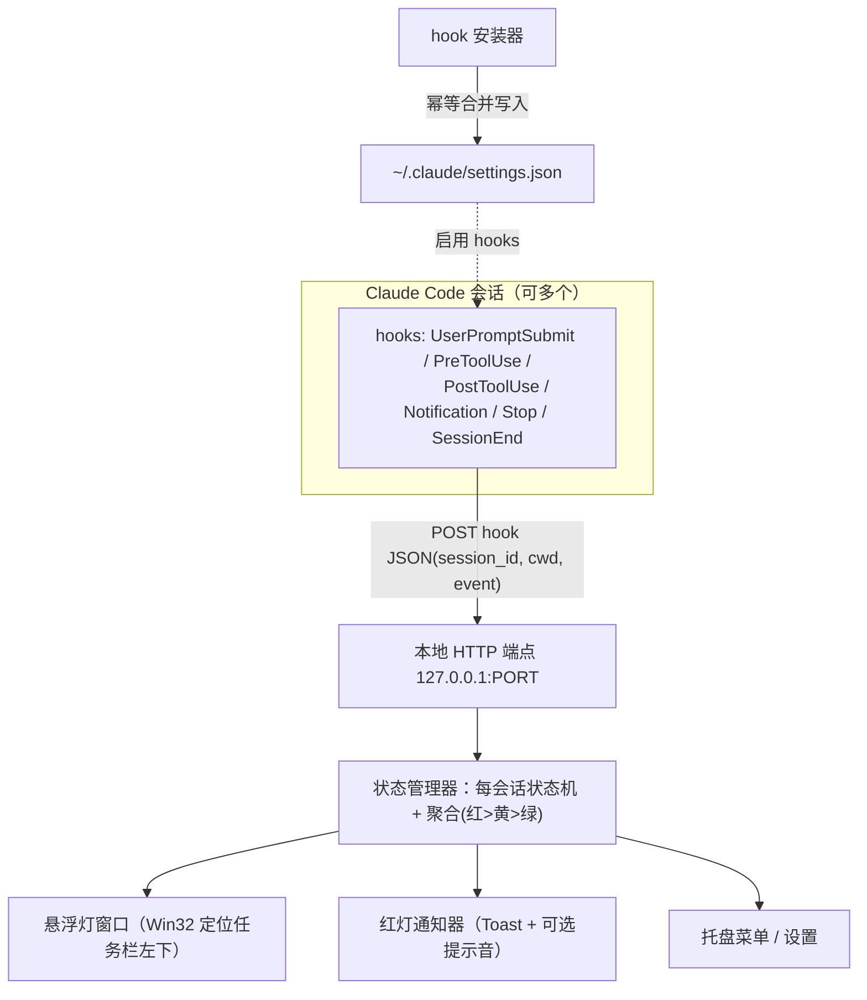
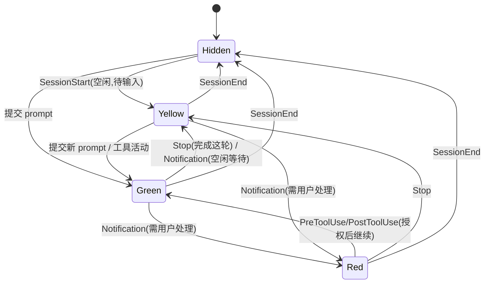

# feat: AI Work Traffic Light — Claude Code 状态红绿灯桌面应用

## Summary

用 Tauri (Rust) 做一个 Windows 桌面常驻应用：通过 Claude Code 官方 hooks 接收状态事件，在任务栏左下角的悬浮窗里用红绿灯反映状态（绿=工作中、黄=该你了、红=卡住等你），红灯时弹系统通知+可选提示音，多会话时显示最紧急的并标出是哪个会话。v1 仅 Windows，点灯跳转窗口记录在案但延后实现。

---

## Problem Frame

用户用 Claude Code 时常切到别的窗口，Claude 在任务中途请求权限/确认时会静默等待，用户察觉不到，任务空等、时间浪费（详见 origin: `docs/brainstorms/2026-06-14-ai-work-traffic-light-requirements.md`）。

技术上的命门是"如何实时知道 Claude Code 的状态"。结论：Claude Code 的 hooks 提供官方、可全局配置、fire-and-forget 的事件机制，不需要任何屏幕抓取。本计划据此设计，并把"hook 真实触发行为"的核验作为第一步 spike——因为本次规划期间外部文档无法联网核实，hook 事件名/字段来自既有知识而非新鲜验证（见 Risks & Assumptions）。

---

## Requirements

承接 origin 文档的 R1–R12。

**状态检测（基于 hooks）**
- R1. 依据 Claude Code 官方 hook 事件判定每个会话状态。
- R2. 事件→状态映射：提交 prompt / 工具活动 → 绿；完成这轮 → 黄；请求权限 / 等待用户 → 红。
- R3. hooks 安装在用户/全局级别，覆盖所有项目和会话，无需逐仓库配置。
- R4. App 自动写入/合并 hook 配置到 `~/.claude/settings.json`，用户无需手动编辑 JSON。

**指示器与状态**
- R5. 单个常驻置顶悬浮小窗显示当前灯，定位在任务栏左下角、天气组件附近。
- R6. 没有任何 Claude Code 会话在运行时，指示器完全隐藏。
- R7. 工作时绿、完成这轮（不紧急）黄、卡住等待用户（紧急）红。

**提醒**
- R8. 切到红灯时弹 Windows 系统通知（含会话标识）+ 可选提示音；全屏遮挡任务栏时也能察觉。黄灯不主动提醒。

**多会话聚合**
- R9. 多会话时灯显示最紧急状态（红 > 黄 > 绿）。
- R10. 红灯时通知与指示器用项目文件夹名标明是哪个会话。
- R11. 会话结束时从聚合中移除其状态并重算；无会话则隐藏。

**交互**
- R12. 点击指示器聚焦/前置需要关注会话的 VSCode 窗口。（记录在案，实现延后到后续阶段，见 Scope Boundaries。）

---

## Key Technical Decisions

- KTD1. **检测走 Claude Code hooks，全局安装。** 在 `~/.claude/settings.json` 注册 hooks，命令以 fire-and-forget 方式把事件推给 app。映射：`UserPromptSubmit`/`PreToolUse`/`PostToolUse` → 绿；`Stop` → 黄；`SessionStart` → 黄（会话空闲、待你输入）；`SessionEnd` → 移除。`Notification` 需按子类型区分：**"需用户处理"类（请求权限/确认）→ 红**，**"空闲等待"类（长时间无输入提醒）→ 黄**——一刀切当红会在空闲时误报。把 `PreToolUse`/`PostToolUse` 也算作"活动=绿"，是为了让红灯在用户授权、Claude 继续后能自动恢复绿（授权本身没有专门 hook）。`Notification` 子类型的判别依据由 U1 实测确定（见 Open Questions）。

- KTD2. **IPC = 本地回环 HTTP 端点。** app 在 `127.0.0.1` 上监听一个端口，hook 命令把 stdin 的 JSON 负载 POST 过去；端点读 `hook_event_name` 分发。理由：即时、hook 端一条命令即可、无文件监听延迟；只绑回环、不对外。（已与用户确认采用此方案而非状态文件。）

- KTD3. **多会话聚合 = 取最紧急。** 维护 `session_id → 状态` 表，灯显示 红>黄>绿 的最高者；会话标识取 `cwd` 的项目文件夹名；表为空则隐藏。

- KTD4. **技术栈 = Tauri v2 (Rust)。** 轻量、低占用、托盘/通知原生支持，未来跨平台路最顺；悬浮窗定位通过 `windows` crate 下沉到 Win32。

- KTD5. **任务栏悬浮窗 = Win32 定位的置顶无边框窗口。** 跟踪任务栏(`Shell_TrayWnd`)矩形 + `SetWindowPos` 保持置顶并贴左下；`WS_EX_TOOLWINDOW` 避免出现在 Alt-Tab；处理任务栏自动隐藏、多显示器、DPI 缩放。全栈最高风险点，先封装、留手动微调。

- KTD6. **hook 安装器幂等合并。** 读取→合并→写回 `~/.claude/settings.json`，写前备份，绝不覆盖用户已有 hooks，可卸载（移除自己注入的项）。

- KTD7. **红灯提醒 = 状态切换时一次性触发。** 进入红灯时弹 Toast（含会话名）+ 可选提示音（设置可关）；黄灯被动不提醒；同一会话持续红不重复轰炸。app 默认随登录自启（设置可关）。

---

## High-Level Technical Design

**组件与数据流**



**单会话状态机**（聚合灯 = 所有会话取最紧急；全部结束→隐藏）



---

## Output Structure

新建 Tauri 项目，预期布局（实现时可调整，以各单元 **Files** 为准）：

```
ai-work-traffic-light/
├── src-tauri/
│   ├── src/
│   │   ├── main.rs          # 入口：托盘、窗口、自启、装配
│   │   ├── ingest.rs        # 本地 HTTP 端点，接收 hook POST
│   │   ├── state.rs         # 每会话状态机 + 多会话聚合
│   │   ├── overlay.rs       # 悬浮窗 Win32 定位/显隐
│   │   ├── notify.rs        # 红灯 Toast + 提示音
│   │   ├── installer.rs     # 合并写入/卸载 ~/.claude/settings.json
│   │   └── settings.rs      # 用户设置持久化
│   ├── Cargo.toml
│   └── tauri.conf.json
├── src/                     # 前端：灯的渲染
│   ├── index.html
│   └── main.ts
├── docs/
│   └── hook-spike-findings.md   # U1 产出
└── package.json
```

---

## Implementation Units

### Phase A — 去风险与地基

### U1. Spike：核验 Claude Code hook 真实行为
- **Goal:** 在写任何 UI 前，确认到底哪些 hook 事件在什么时机触发、stdin 负载有哪些字段，尤其"Claude 请求权限"那一刻是否可靠触发 `Notification`；终端与 VSCode 扩展是否一致。
- **Requirements:** R1, R2（为其奠定事实依据）
- **Dependencies:** 无
- **Files:** `docs/hook-spike-findings.md`（findings）；临时 hook 脚本（验证用，不入库）
- **Approach:** 在 `~/.claude/settings.json` 临时注册一套把事件名+stdin 追加到日志文件的 hook，覆盖 `UserPromptSubmit`/`PreToolUse`/`PostToolUse`/`Notification`/`Stop`/`SessionStart`/`SessionEnd`。在终端和 VSCode 扩展里各跑一次真实任务，制造一次"需要权限确认"的操作，再制造一次"长时间空闲不输入"，记录观察到的事件序列与字段（`session_id`/`cwd`/`hook_event_name`/`message` 等是否存在）。**重点记录每次 `Notification` 的 `message` 文本**，确定如何区分"需用户处理（请求权限/确认）"与"空闲等待"两类，作为 KTD1 红/黄判别依据；并观察 `SessionStart` 的触发时机与负载。把结论写进 findings，据此确认/修正 KTD1 映射。
- **Execution note:** 这是探查单元，先观察后定论；若 `Notification` 未覆盖某些"需确认"情形，在 findings 里记录并据此调整映射（如增用其它事件兜底）。
- **Test scenarios:** Test expectation: none -- spike/调查单元，产出为 findings 文档与确认后的映射。
- **Verification:** findings 文档列出每个事件的真实触发时机与字段；KTD1 映射被证据确认或修正；明确"请求权限→红"这条链路可行。

### U2. Tauri 应用骨架 + 托盘 + 自启
- **Goal:** 可在 Windows 构建运行的 Tauri v2 骨架：系统托盘图标、无主窗口常驻、随登录自启（可关）。
- **Requirements:** R5（承载后续悬浮窗）
- **Dependencies:** 无（可与 U1 并行）
- **Files:** `src-tauri/src/main.rs`, `src-tauri/Cargo.toml`, `src-tauri/tauri.conf.json`, `src/index.html`, `src/main.ts`, `package.json`
- **Approach:** 初始化 Tauri v2；配置无任务栏按钮的后台运行；托盘菜单占位（退出）；用 Tauri autostart 插件实现登录自启，设置项控制开关。
- **Patterns to follow:** Tauri v2 官方 tray-icon 与 autostart 插件用法。
- **Test scenarios:**
  - 构建产物能在 Windows 启动并常驻托盘，无多余主窗口。
  - 自启开关开/关后，登录项相应被写入/移除。
  - Test expectation: 其余为脚手架，无行为测试。
- **Verification:** 托盘图标出现、右键可退出；自启开关生效。

### Phase B — 状态管道

### U3. 本地状态接入端点
- **Goal:** 在 `127.0.0.1` 监听端口，接收 hook POST 的 JSON，解析出会话与事件，交给状态管理器。
- **Requirements:** R1, R2
- **Dependencies:** U2
- **Files:** `src-tauri/src/ingest.rs`, `src-tauri/src/main.rs`(装配)
- **Approach:** 在 Rust 侧起一个轻量 HTTP 服务（仅绑回环）；单一接收路由，读 body 里的 hook JSON，按 `hook_event_name` 分发；端点立即返回 200（不阻塞 hook）。端口固定+冲突时回退选择，端口写入约定位置供安装器引用。
- **Patterns to follow:** U1 findings 里确认的字段名。
- **Test scenarios:**
  - 合法负载（含 `session_id`/`cwd`/事件名）被正确解析并转交状态管理器。
  - 畸形/空 JSON：返回非 5xx、不 panic、记录并丢弃。
  - 未知事件名：安全忽略。
  - 并发多个 POST（多会话同时触发）：均被处理，无竞态丢失。
  - 端点响应快速返回，不因下游处理而阻塞。
- **Verification:** 用伪造 POST 能驱动状态管理器；并发与畸形输入不崩。

### U4. 会话状态机与多会话聚合
- **Goal:** 每会话状态机（KTD1 映射 + 心跳恢复绿）、多会话聚合取最紧急、会话标识取项目文件夹名、`SessionEnd` 移除、空则隐藏。
- **Requirements:** R2, R6, R7, R9, R10, R11
- **Dependencies:** U3
- **Files:** `src-tauri/src/state.rs`
- **Approach:** 维护 `session_id → {state, project_name}`；事件更新对应会话状态（活动事件→绿、`Stop`→黄、`SessionStart`→黄(空闲)、`Notification` 按 U1 分类→红(需处理)或黄(空闲等待)、`SessionEnd`→删）；`project_name` 由 `cwd` 末段推导，同一项目多会话重名时附加短 `session_id` 后缀消歧；聚合输出 = 红>黄>绿的最高者及其会话标识，空表→Hidden。状态变化通过事件/通道通知 overlay、notifier、tray。
- **Test scenarios:**
  - 单会话：提交→绿、`Notification`→红、`PostToolUse`→回绿、`Stop`→黄。
  - Covers AE5. 黄态下来一个活动事件（新 prompt）→ 转绿。
  - Covers AE3. 两会话（A 绿、B 黄），A 触发 `Notification` → 聚合红，且标识为 A 的项目名。
  - Covers AE2. 无会话（或全部 `SessionEnd`）→ 聚合为 Hidden。
  - `cwd` → 项目名推导：常规路径、尾斜杠、盘符根、含空格路径。
  - 红优先：一会话红、其余绿/黄 → 聚合红并指向红的那个。
  - 同会话重复同态事件不产生多余切换。
  - `SessionStart` → 该会话空闲(黄)；随后 `UserPromptSubmit` → 绿。
  - `Notification` 分类映射：标记为"需用户处理"→红；标记为"空闲等待"→黄（不误报红）。
  - 同一项目（相同 `cwd`）两个会话：标识附加 `session_id` 后缀可区分，不混淆。
- **Verification:** 给定事件序列，聚合状态与会话标识符合上述用例。

### U5. hook 安装器（幂等合并 / 卸载）
- **Goal:** 把指向本地端点的 hook 配置安全合并进 `~/.claude/settings.json`，幂等、带备份、可卸载，不碰用户已有 hooks。
- **Requirements:** R3, R4
- **Dependencies:** U3（需要端点端口与命令形态），U1（命令可行性）
- **Files:** `src-tauri/src/installer.rs`
- **Approach:** 解析现有 settings（不存在则新建）；为目标事件追加一条 POST 到本地端点的命令型 hook，打自有标记以便识别；写前备份原文件；再次运行检测到已存在则跳过（幂等）；卸载移除带标记项。hook 命令形态（`curl` vs PowerShell `Invoke-WebRequest`）取决于 U1/Windows 可用性，需快超时、fire-and-forget。
- **Test scenarios:**
  - 全新（无 settings 文件）：生成含本计划 hooks 的有效 JSON。
  - 合并：已有用户 hooks 时，注入后用户原有项保留无损。
  - 幂等：连续安装两次不产生重复项。
  - 畸形/非法 JSON 的既有 settings：不破坏原文件、报错可恢复（备份在）。
  - 卸载：仅移除自有标记项，用户项保留。
- **Verification:** 安装后 `~/.claude/settings.json` 含可用 hooks 且能驱动端点；卸载后干净复原。

### Phase C — 可见面

### U6. 任务栏左下悬浮灯窗口
- **Goal:** 置顶无边框窗口渲染当前灯，用 Win32 定位贴任务栏左下（天气旁），随聚合状态显隐/变色；无会话隐藏。
- **Requirements:** R5, R6, R7
- **Dependencies:** U4
- **Files:** `src-tauri/src/overlay.rs`, `src/index.html`, `src/main.ts`
- **Approach:** 无边框、置顶、`WS_EX_TOOLWINDOW`、点击穿透按需；通过 `windows` crate 取任务栏矩形并 `SetWindowPos` 贴左下；监听状态变化更新颜色或隐藏；处理任务栏自动隐藏、多显示器、DPI 缩放；位置可手动微调（设置）。前端渲染一个简单的彩色灯。
- **Patterns to follow:** TrafficMonitor/BatteryBar 的"悬浮窗贴任务栏"思路（见 origin Sources）。
- **Test scenarios:**
  - 状态→外观：绿/黄/红分别渲染对应颜色；Hidden 时窗口不可见。
  - Covers AE2. 聚合 Hidden → 窗口隐藏。
  - 定位逻辑（可单元化的部分）：给定任务栏矩形与 DPI，算出的窗口坐标落在左下预期区域。
  - 多显示器 / 任务栏在不同边 / 自动隐藏：手动验证不错位或有合理降级。
- **Verification:** 灯出现在任务栏左下并随状态变色；无会话时消失；多屏/缩放下手动验证可接受。

### U7. 红灯通知 + 提示音
- **Goal:** 进入红灯时弹 Windows Toast（含会话项目名）+ 可选提示音；黄灯不提醒；持续红不重复轰炸。
- **Requirements:** R8, R10
- **Dependencies:** U4
- **Files:** `src-tauri/src/notify.rs`
- **Approach:** 订阅状态管理器的"切入红灯"事件（边沿触发，非持续）；用 Tauri/WinRT Toast 发通知，标题/正文带会话项目名；提示音按设置开关播放；记录已通知的红态会话，避免重复。
- **Test scenarios:**
  - Covers AE1. 某会话由绿转红（请求权限）→ 触发一次 Toast，文案含该会话项目名。
  - Covers AE4. Toast/提示音为系统级，任务栏被全屏遮挡时仍触发（不依赖悬浮窗可见）。
  - 黄灯不触发通知。
  - 同会话持续红不重复弹；该会话恢复后再次转红可再次弹。
  - 提示音开关：关时静默只弹视觉通知。
- **Verification:** 红灯边沿可靠弹一次带会话名的通知；声音受设置控制；黄灯静默。

### U8. 托盘菜单与设置
- **Goal:** 托盘菜单：启用/停用、提示音开关、自启开关、安装/卸载 hooks、退出；设置持久化。
- **Requirements:** R3, R4, R8（提示音开关）
- **Dependencies:** U2, U5, U7
- **Files:** `src-tauri/src/settings.rs`, `src-tauri/src/main.rs`(菜单装配)
- **Approach:** 托盘菜单项绑定到安装器(U5)、通知设置(U7)、自启(U2)；设置持久化到本地配置；启动时加载。
- **Test scenarios:**
  - 菜单触发"安装 hooks"→ 调 U5 安装；"卸载"→ 调 U5 卸载。
  - 提示音/自启开关持久化：重启后保留。
  - 设置读写：缺失配置文件时用默认值（自启=开、提示音=开）。
- **Verification:** 菜单各项生效；设置跨重启保留。

---

## Acceptance Examples

承接 origin AE1–AE5，已分配到上述单元的 **Test scenarios**：
- AE1（请求权限→红+通知）→ U4(红态) + U7(通知)
- AE2（无会话→隐藏）→ U4(聚合 Hidden) + U6(窗口隐藏)
- AE3（双会话其一变红）→ U4(聚合+会话标识)
- AE4（全屏遮挡仍提醒）→ U7(系统级 Toast/提示音)
- AE5（完成后新指令→转绿）→ U4(状态转移)

---

## Scope Boundaries

**v1 覆盖**：上述 U1–U8（R1–R11 全部）。

### Deferred to Follow-Up Work
- R12 点灯跳转对应 VSCode 窗口：需求记录在案，实现延后。依赖"如何聚焦特定 VSCode 窗口"的方案（见 Open Questions）。建议在 U4/U6 稳定后作为独立单元接入。

**先放后面（origin 决定）**
- macOS、Linux 支持（v1 仅 Windows）。
- 黄灯的主动提醒（v1 黄灯仅被动显示）。

**不属于本产品定位（origin 决定）**
- Claude 桌面聊天 App 的状态检测（无 hooks，痛点也不在此）。
- 会话仪表盘/历史/统计/会话管理——本产品是氛围状态灯，不是 Claude 管理器。
- 用 ExplorerPatcher 等恢复经典任务栏/deskband 的方案（脆弱、与 Windows 对抗）。

---

## Risks, Dependencies & Assumptions

**Risks**
- **Notification 语义不确定（最高风险）。** `Notification` 既可能在"需用户处理"时触发（→红），也可能在"空闲等待"时触发（应为黄）；还可能在 VSCode 扩展与终端表现不同。一刀切当红会误报。缓解：U1 spike 先实测 `message` 子类型并据此分类映射（红/黄），用 `PreToolUse`/`PostToolUse` 活动事件兜底恢复绿。
- **Win32 悬浮窗定位脆弱。** Win11 更新、任务栏自动隐藏、多显示器、DPI 都可能让定位错位。缓解：封装定位层、提供手动微调、多屏手动验证。
- **hook 同步超时拖慢 Claude。** hook 命令同步执行且有超时，慢 POST 会拖慢 Claude。缓解：命令短超时、fire-and-forget；端点立即返回。
- **本次外部研究不可用。** 规划期间 web/子代理均报错，hook 事件名与字段来自既有知识、未经新鲜核实。缓解：U1 spike 即为验证闸门，写码前先证实。

**Dependencies**
- 已安装 Claude Code（终端 / VSCode 扩展）。
- 用户使用 Windows 11。
- Windows 上的 WebView2 运行时（Tauri 依赖，通常已随系统具备）。
- 可安全读写 `~/.claude/settings.json`。

**Assumptions（未经本次核实，待 U1 证实）**
- hook stdin JSON 含 `session_id` 与 `cwd`（用于区分会话、推导项目名）。
- hook 命令可执行任意 shell 命令（用于 POST 到本地端点）。
- VSCode 扩展与终端的 hook 行为一致。

---

## Open Questions

**Deferred to Implementation**
- hook 负载确切字段名 —— U1 确认。
- `Notification` 子类型如何判别（"需用户处理" vs "空闲等待"）：靠 `message` 文本还是其它字段 —— U1 实测确定，直接影响红/黄准确性。
- hook 命令用 `curl` 还是 PowerShell `Invoke-WebRequest`（Windows 可用性 + 速度）—— U1/U5 定。
- 本地端口选择与冲突处理细节 —— U3 定。
- 如何聚焦特定 VSCode 窗口（R12 跳转所需）—— 延后单元再定。

---

## Sources / Research

- 本计划外部文档研究本次不可用（web 工具 429 / 子代理 400），hook 细节来自既有知识，U1 为验证闸门。
- origin 需求文档：`docs/brainstorms/2026-06-14-ai-work-traffic-light-requirements.md`。
- Claude Code Hooks 文档（待联网时复核）：https://code.claude.com/docs/en/hooks
- Windows 11 deskband 弃用 / 悬浮窗贴任务栏参考（origin 已收录）：TrafficMonitor、BatteryBar；gHacks "Microsoft crippled the Windows 11 Taskbar"。
- 技术栈：Tauri v2（tray-icon、autostart、notification 插件；`windows` crate 做 Win32 定位）。
